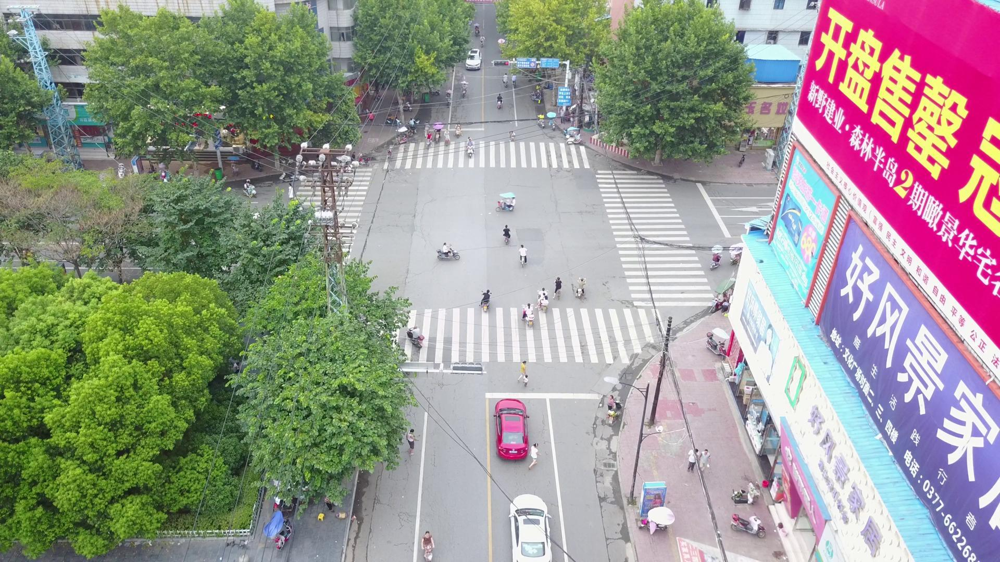

# Aerial Object Detection with YOLOv8

Train a YOLOv8 model on aerial imagery and use the same detector through a command-line tool, a FastAPI service, or a Streamlit upload interface. The original training configuration targets VisDrone data exported from Roboflow.

## Capabilities

| Interface | Inputs | Outputs |
| --- | --- | --- |
| Command line | Local images and videos | Annotated files and optional JSON detections |
| Streamlit | Uploaded images and videos | Detection details and a downloadable annotated video |
| FastAPI | Uploaded image | Class names, confidence scores, and bounding boxes |
| Training | Local YOLO dataset or Roboflow export | Training artifacts and an exported best checkpoint |

Inference selects CUDA when available and otherwise uses the CPU. The repository contains sample images and code; **trained weights and datasets are not included**.

## Existing demo

https://github.com/user-attachments/assets/c4399ebd-9891-4bf0-9a91-435409b02493

Included example input:



## Install

Use a fresh environment with **64-bit Python 3.11**.

```bash
git clone https://github.com/Muhammad-Huzifa/Aerial-Object-Detection-YOLOv8.git
cd Aerial-Object-Detection-YOLOv8
```

On Windows Command Prompt:

```bat
py -3.11 -m venv .venv
.venv\Scripts\activate.bat
python -m pip install --upgrade pip
python -m pip install -r requirements.txt
python setup.py --skip-install
```

In Git Bash on Windows, activate the same environment with `source .venv/Scripts/activate`. On Linux or macOS, create it with `python3.11 -m venv .venv` and activate it with `source .venv/bin/activate`.

The requirements pin PyTorch 2.4.1 and TorchVision 0.19.1 alongside Ultralytics 8.3.0. For a specific CPU or CUDA wheel, use the matching [PyTorch installation command](https://pytorch.org/get-started/previous-versions/#v241) before installing the remaining requirements.

## Provide model weights

Place a trained checkpoint at `models/best.pt`, or pass another path to the command-line tool with `--weights`. The API and web app also accept the `AERIAL_MODEL_PATH` environment variable.

Training with this repository exports its best checkpoint to `models/best.pt` automatically. The pretrained `yolov8n.pt` model is a training initializer; its original labels are not the VisDrone label set.

## Run image or video inference

With a checkpoint in place:

```bash
python predict.py --source examples/test.jpg --output output/test_detected.jpg --json output/test_detections.json
```

For your own local video:

```bash
python predict.py --source data/demo.mp4 --output output/demo_detected.mp4 --json output/demo_detections.json
```

Use `--conf 0.25` and `--iou 0.45` to set thresholds. Video preview is optional: add `--preview` on a desktop with OpenCV display support, then press **Q** to stop. The default command does not open a display window.

## Run the web app or API

```bash
python -m streamlit run app.py
```

Open [http://localhost:8501](http://localhost:8501).

```bash
python -m uvicorn api:app --host 127.0.0.1 --port 8000
```

API documentation: [http://localhost:8000/docs](http://localhost:8000/docs). Image requests use multipart form data; see the [API guide](docs/api.md) for an example.

## Train a model

For an existing YOLO dataset whose configuration is at `data/visdrone/data.yaml`:

```bash
python train.py --data data/visdrone/data.yaml --epochs 100 --batch 16 --imgsz 640
```

Roboflow downloading requires the optional SDK, a `ROBOFLOW_API_KEY` environment variable, and access to the selected project. See the [training guide](docs/training.md) for installation, environment commands, dataset paths, and training options.

## Project organization

| Path | Purpose |
| --- | --- |
| `aerial_detection/` | Shared detector, training, paths, and inference utilities |
| `apps/api.py` | FastAPI image upload service |
| `apps/streamlit_app.py` | Streamlit image and video interface |
| `examples/` | Original sample images |
| `docs/` | Training, API, development, and troubleshooting guides |
| `tests/` | Regression checks, with model and video I/O mocked |
| `train.py`, `predict.py`, `app.py`, `api.py` | Small launchers for common commands |
| `setup.py` | Environment bootstrap utility |
| `shortvideo.py` | Optional video URL download and inference |
| `models/`, `data/`, `output/`, `visdrone_training/` | Local weights, datasets, and generated results; ignored by Git |

The original `detector.py` import and `test_inference.py` launcher remain available. Inference commands now take explicit arguments instead of assuming a particular video filename.

## Documentation and checks

- [Training and model weights](docs/training.md)
- [API requests and responses](docs/api.md)
- [Development, Git commands, and troubleshooting](docs/development.md)

```bash
python -m unittest discover -s tests -v
```

## Model scope

The original project targets these VisDrone categories: pedestrian, people, bicycle, car, van, truck, tricycle, awning-tricycle, bus, and motor. Actual class labels are read from the loaded checkpoint. Webcam streaming is not implemented.

No benchmark results or trained checkpoint are included, so the repository does not establish a measured accuracy or inference speed.

## Author

[Muhammad Huzifa](https://github.com/Muhammad-Huzifa)
